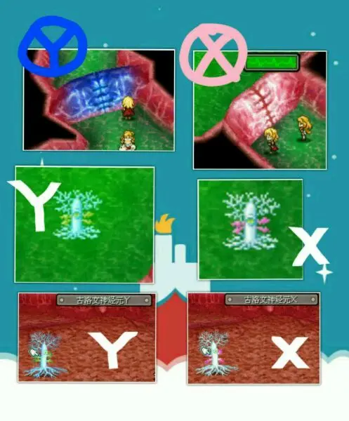
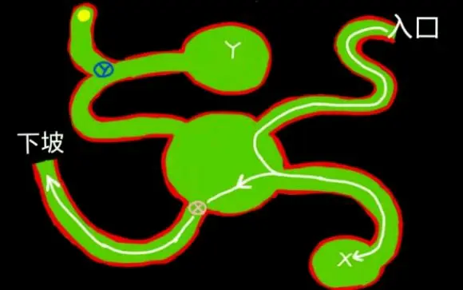
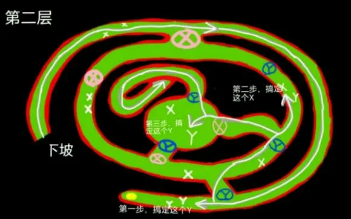
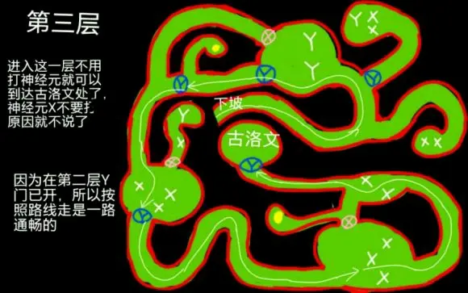

> 引用自：[https://www.bilibili.com/read/mobile?id=16049252](https://www.bilibili.com/read/mobile?id=16049252)

岛屿外部地图较为简单，不做介绍，仅提供内部地图

进迷宫之前需要知道一个原理，打X神经元开红门，蓝门关闭，打Y神经元则相反，如图一所示

第一层为教学层，明示迷宫原理，沿白线走解决X神经元即可。其中黄色点为上风气孔点，可快速脱离迷宫。

第一层如图二所示

第二层，沿白线走即可，注意说明

第三层，千万注意，不需要碰一个神经元

因为通往古洛文处全是Y门，而我们在第二层已经打过Y神经元。

路上全是X神经元，只要打一个，Y门关闭，就得重头回去打Y神经元，这就是第三层难走的原因，因为总是忍不住清掉神经元